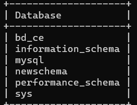
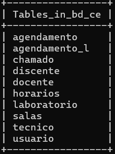

# Ferramenta de auxilio para o CE UFRN 

Chamando chaves estrangeiras de outras tabelas:

```SQL 

CREATE TABLE horarios (
    id INT AUTO_INCREMENT,
    id_salas INT,
    id_agendamento INT,
    id_usuario INT,
    PRIMARY KEY (id),
    FOREIGN KEY (id_salas) REFERENCES salas(id),
    FOREIGN KEY (id_agendamento) REFERENCES agendamento(id),
    FOREIGN KEY (id_usuario) REFERENCES usuario(id)
);
```

### Tabelas Criadas


#### DB name



#### Tabelas Feitas 




